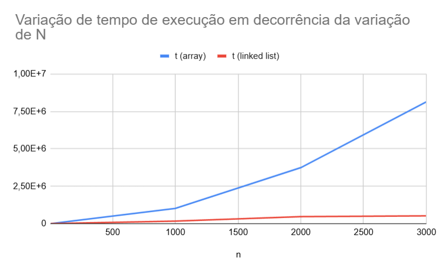

# Liked List e Array List

## Visão Geral

Este projeto implementa estruturas de dados básicas em C++:

1. **Array List**
2. **Linked List**

Cada estrutura de dados é projetada para ser eficiente e modular, com testes que validam suas operações principais.

---

### Conteúdo:
### Array List
Uma lista baseada em array que fornece:
- Inserção no início (push_front)
- Inserção no final (push_back)
- Remoção em posições específicas (remove_at)
- Obtenção de elementos em uma posição específica (get_at)
- Inserção na posição desejada do índice (insert_at)
- Limpeza da lista (clear)
- Remoção do último elemento (pop_back)
- Remoção do primeiro elemento (pop_front)
- Exibição do primeiro elemento (front)
- Exibição do último elemento (back)
- Remoção da primeira ocorrência de um valor na lista (remove)
- Busca de um valor na lista (find)
- Busca da quantidade de vezes em que um valor se repete na lista (cout)
- Somatória dos elementos a lista (sum)


### Linked List
Uma lista duplamente encadeada que suporta:
- Inserção no início (push_front)
- Inserção no final (push_back)
- Remoção em posições específicas (remove_at)
- Obtenção de elementos em uma posição específica (get_at)
- Inserção na posição desejada do índice (insert_at)
- Limpeza da lista (clear)
- Remoção do último elemento (pop_back)
- Remoção do primeiro elemento (pop_front)
- Exibição do primeiro elemento (front)
- Exibição do último elemento (back)
- Remoção da primeira ocorrência de um valor na lista (remove)
- Busca de um valor na lista (find)
- Busca da quantidade de vezes em que um valor se repete na lista (count)
- Somatória dos elementos da lista (sum)

---

## Estrutura do Projeto

- **array_list.hpp**: Definição e implementação da classe Array List.
- **linked_list.cpp**: Implementação da classe Linked List.
- **test-pushfront-array-list-01.cpp**: Teste de desempenho para inserções no início de uma Array List.
- **test-removeat-array-list-01.cpp**: Teste de desempenho para remoções em uma Array List.
- **README.md**: Documentação do projeto.
- **tests**: Pasta para armazenamento dos testes.

---

## Testes e Execução

Os testes foram desenvolvidos para avaliar o desempenho das operações implementadas.

### Teste: `test-pushfront-array-list-01`
Mede o tempo necessário para adicionar elementos no início da `array_list`.

#### Execução:
```bash
$ g++ -o test_push test-pushfront-array-list-01.cpp
$ ./test_push
```

### Teste: `test-pushfront-linked-list-01`
Mede o tempo necessário para adicionar elementos no início da `linked_list`.

#### Execução:
```bash
$ g++ -o test_push_ll test-pushfront-linked-list-01.cpp
$ ./test_push_ll
```

[Clique aqui para ver mais testes e o tempo deles](tests)

## Gráfico de Push

Abaixo está o gráfico em função de tempo das inserções acima:



---